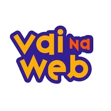

# Projeto API
Projeto desenvolvido para consolidar os conhecimentos em API com React.

## 🔥 Introdução
Projeto final do módulo de Frontend da Formação Full Stack da [@vainaweb](https://www.instagram.com/vainaweb/)

## 🎯📌🔗

## 📦 Tecnologias usadas
- Vite
- React JS
- JavaScript(Jsx)
- Sass
- Axios
- API

## 👷 Autores
- **Tatyane Gonçalves** - *Desenvolvedora* - [@tatyanepgoncalves](https://github.com/tatyanepgoncalves)
- **Equipe Vai na Web** - *Criador e educador técnico* - [@vainaweb](https://www.instagram.com/vainaweb/)

## 💡 Expressões de gratidão
Se gostei, deixe o ❤️ no repositório.

 
  

